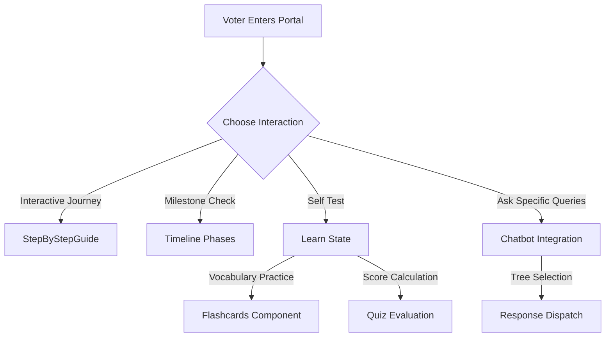

# VoteAssist India 🗳️

**VoteAssist India** is an interactive Single Page Application (SPA) designed to empower citizens with robust, easy-to-digest knowledge surrounding the Indian Electoral Process. Designed for smooth performance, visual clarity, and responsiveness.

---

## 🏗️ Architecture & Core Components

The implementation separates operations into standard modules:

## 🛠️ Feature Modules

1. **Voter Journey Guide (`src/components/StepByStepGuide.jsx`)**
   Navigates through standard election steps: Voter Registration, Knowing candidates via ECI apps, locating the polling booth, and standard verification procedures.

2. **Milestone Tracking (`src/components/Timeline.jsx`)**
   Provides context for the multi-stage Lok Sabha structure.

3. **Gamified Education Hub (`src/components/Flashcards.jsx` & `src/components/Quiz.jsx`)**
   Reinforces knowledge about standard equipment configurations.

## 🚀 Live Environment

The app builds dynamically and updates directly at:
🌐 **[https://election-assistant-712464373646.us-central1.run.app](https://election-assistant-712464373646.us-central1.run.app)**

---
*Created in collaboration for modern civic learning.*
